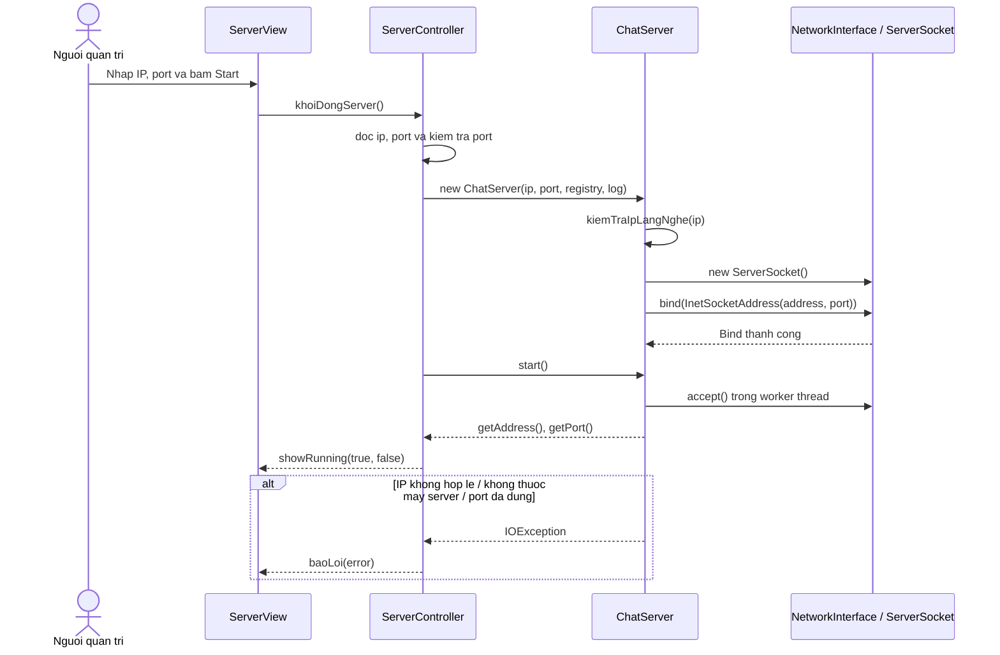
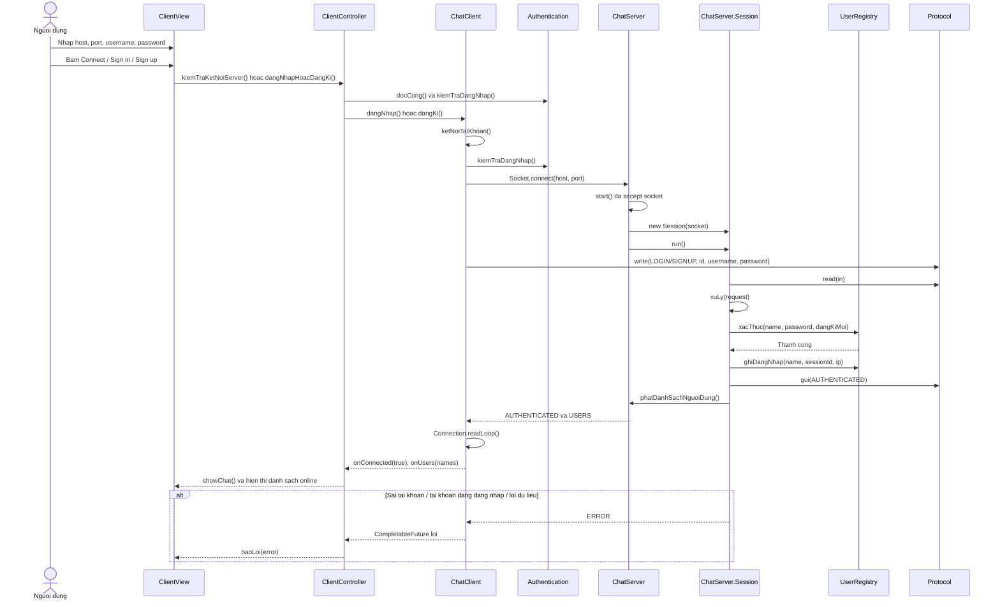
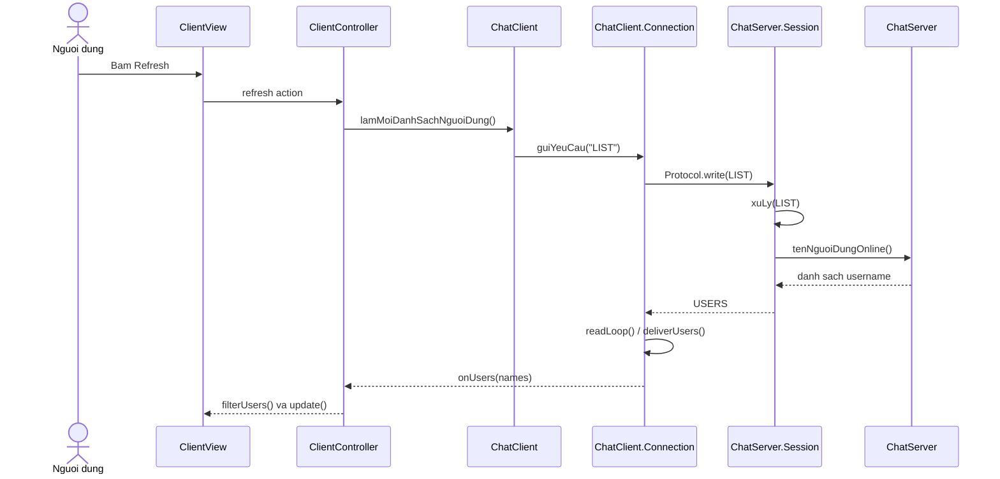
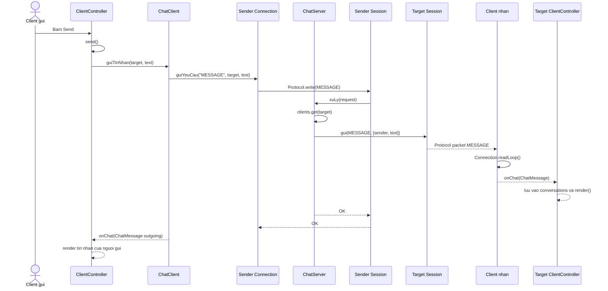
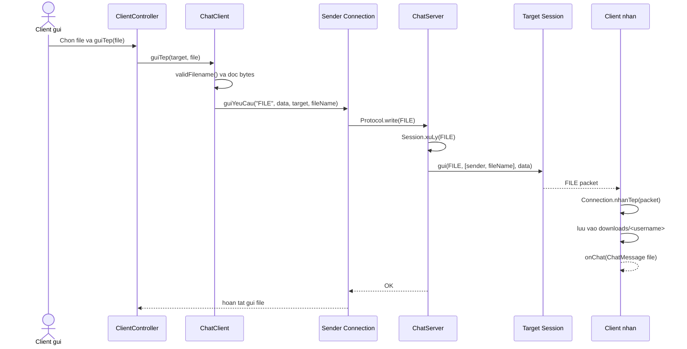
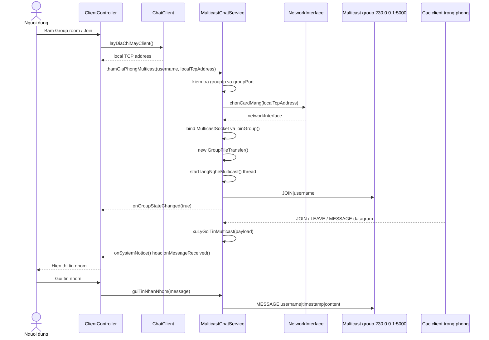
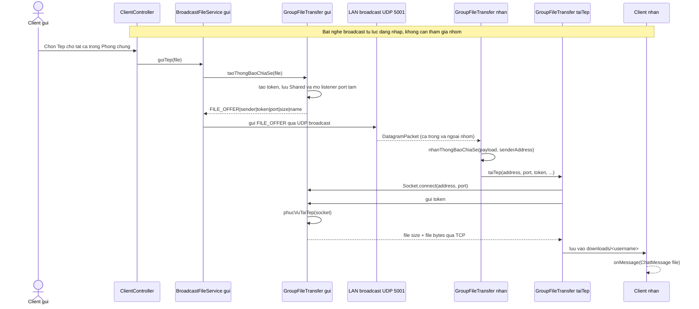
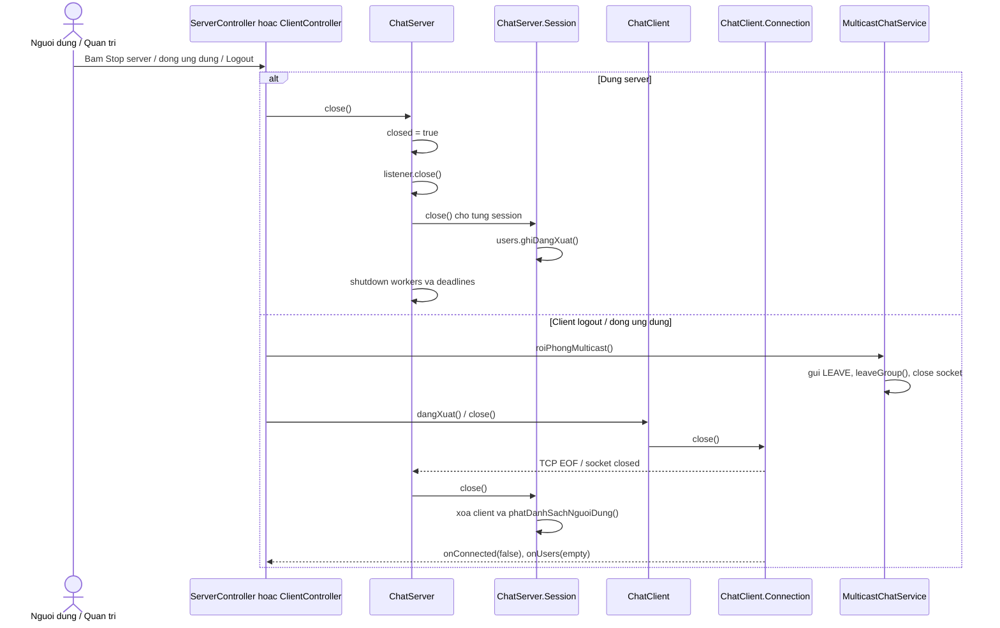

# Sequence diagrams

Tai lieu nay mo ta cac luong chinh cua ung dung theo ten ham trong source code.

## 1. Khoi dong server va bind IP

`0.0.0.0` duoc chap nhan trong `kiemTraIpLangNghe()` va bind tat ca interface. Neu nhap IP LAN cu the, server chi bind interface do.

## 2. Ket noi, dang nhap hoac dang ky

## 3. Lay lai danh sach nguoi dung online

## 4. Chat rieng qua TCP

## 5. Gui file rieng qua TCP

## 6. Tham gia phong va chat nhom qua UDP multicast

## 7. Gui tep cho tat ca: UDP broadcast offer + TCP noi dung

## 8. Dung server va dong ket noi

## Bang tom tat chuc nang

| Chuc nang | UI/controller | Lop xu ly chinh | Kieu mang | Packet/chuyen tiep |
|---|---|---|---|---|
| Khoi dong server | `ServerController.khoiDongServer()` | `ChatServer` | TCP listen | `bind(IP, port)` |
| Kiem tra IP lang nghe | `ServerController.khoiDongServer()` | `ChatServer.kiemTraIpLangNghe()` | Local network | IP cu the hoac `0.0.0.0` |
| Dang nhap | `ClientController.dangNhapHoacDangKi()` | `ChatClient`, `ChatServer.Session` | TCP | `LOGIN` |
| Dang ky | `ClientController.dangNhapHoacDangKi()` | `ChatClient`, `UserRegistry` | TCP | `SIGNUP` |
| Danh sach online | `ClientController` refresh | `ChatClient`, `ChatServer` | TCP | `LIST`, `USERS` |
| Chat rieng | `ClientController.send()` | `ChatClient`, `Session.xuLy()` | TCP | `MESSAGE` |
| File rieng | `ClientController.guiTep()` | `ChatClient`, `Session.xuLy()` | TCP | `FILE` + bytes |
| Join phong nhom | `ClientController.thamGiaPhongMulticast()` | `MulticastChatService` | UDP multicast | `JOIN` |
| Chat nhom | `ClientController.send()` | `MulticastChatService` | UDP multicast | `MESSAGE` |
| Tep cho tat ca | `ClientController.guiTep()` | `BroadcastFileService`, `GroupFileTransfer` | UDP broadcast + TCP data | `FILE_OFFER` + token |
| Dung/thoat | `ServerController.dungServer()` / `ClientController.close()` | `close()`, `roiPhongMulticast()` | TCP + UDP | `LEAVE`, dong socket |
